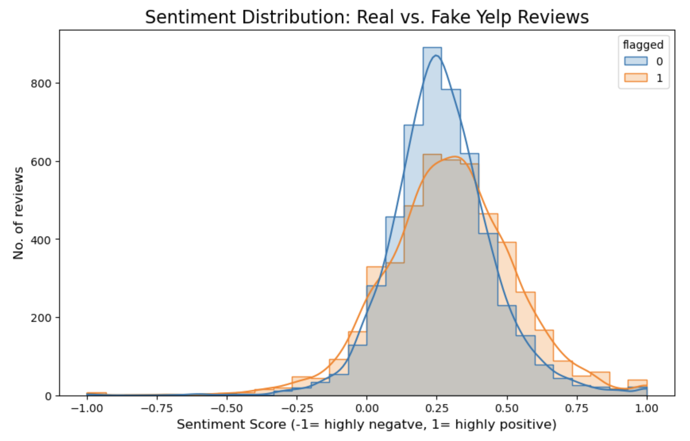

# 🕵️ Yelp Review Fraud Detection: Machine Learning for Trust & Safety

**INF2179: Machine Learning Executive Project**

This repository contains the machine learning pipeline and strategic executive report developed to detect fraudulent and deceptive reviews on Yelp. The core objective was to build a predictive model that protects platform integrity and ensures a trustworthy user experience.

## 🎯 Business Impact & Product Strategy
Fake reviews erode user trust and degrade the core value proposition of review-based platforms. This project moved beyond simple accuracy metrics to focus on actionable Trust & Safety interventions.

* **Strategic Threat Mitigation:** Developed an NLP-driven classification strategy to identify deceptive language patterns, protecting the platform from astroturfing and coordinated review manipulation.
* **Executive Translation:** Synthesized complex NLP and model evaluation metrics into an Executive Report, providing clear product recommendations for integrating the model into a live moderation queue.

## 🧠 Technical Methodology
The project required a full-stack data science approach, focusing on text mining, natural language processing, and supervised learning.

* **Natural Language Processing (NLP):** Conducted extensive text pre-processing, tokenization, and sentiment analysis to engineer features from raw unstructured review text.
* **Predictive Modeling:** Trained, evaluated, and tuned classification models (including Logistic Regression and ensemble methods) to isolate the linguistic signatures of fake reviews.
* **Model Evaluation:** Prioritized precision/recall balance to ensure legitimate user reviews were not mistakenly flagged (minimizing false positives for a frictionless UX).

## 📂 Repository Contents
* `INF2179_Group 1 Executive Report.pdf`: The strategic business report outlining the problem space, methodology, and final product recommendations.
* `INF2179 - ML Yelp Fake Reviews.pdf`: The technical presentation deck detailing the NLP pipeline and model performance.
* `[Insert Your Notebook Name].ipynb`: The core Python data analysis, NLP, and machine learning pipeline.
